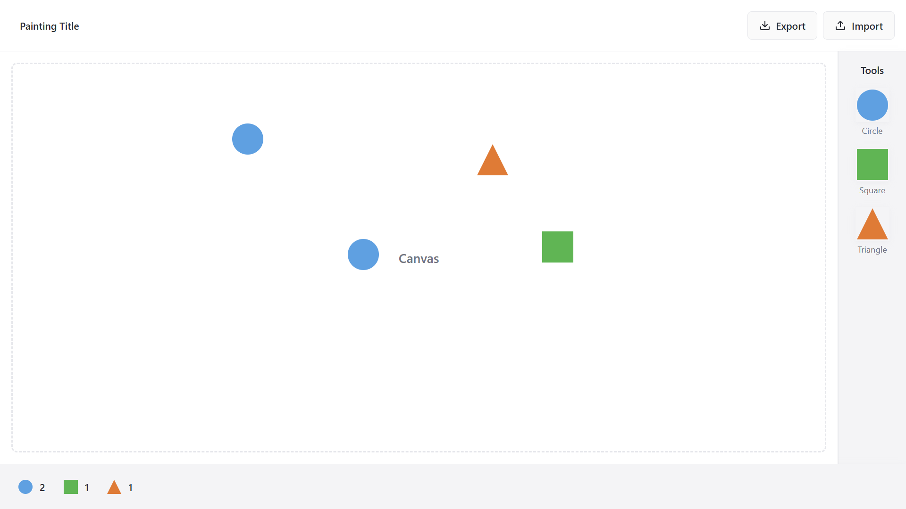

# تمرین دستگرمی دوم (نقاشی بکش لویی بخش اول)

در این پروژه با استفاده از کتابخانه React JS یک ابزار نقاشی نقاشی با قابلیت‌های زیر درست کرده ایم:

* امکان اضافه کردن اشکال پیش فرض مربع، مثلث و دایره از نوار ابزار به صفحه نقاشی به تعداد نامحدود به وسیله drag and drop
* حذف اشکال اضافه شده به صفحه به وسیله دوبار کلیک روی آنها
* نشان دادن تعداد اشکال اضافه شده به صفحه به صورت آنی در نوار وضعیت
* امکان تغییر نام نقاشی رسم شده
* امکان خروجی گرفتن به فرمت json و ذخیره نقاشی
* امکان وارد کردن نقاشی با فرمت json به صفحه

## نحوه کارکرد برنامه

نمای کلی برنامه در تصویر زیر آمده است:



همانطور که در تصویر فوق مشاهده می‌کنید، ساختار صفحه از بخش های سرصفحه، بوم اصلی، نوار ابزار در سمت راست و نوار وضعیت در پایین صفحه تشکیل شده است. برای اضافه کردن شکل ها از نوار ابزار به صفحه، کافی است شکل مورد نظر را گرفته و در مکان دلخواه در صفحه رها نماییم. برای حذف کردن شکل دلخواه نیز کافی است روی آن دوبار کلیک کنیم. در هر لحظه، تعداد اشکالی که صفحه موجود است، برحسب نوع آنها در نوار وضعیت پایین نشان داده می شود. در قسمت سرصفحه امکان تغییر نام نقاشی کشیده شده وجود دارد. همچنین به کمک دکمه export می توان از نقاشی رسم شده خروجی به فرمت json گرفت. همچنین به کمک دکمه import می توان فایل json ای که قبلا خروجی گرفته شده را مجددا وارد بوم نقاشی کرد و آن را تغییر داد.

## ساختار و نحوه کارکرد برنامه

در این بخش به توضیح component های اصلی پیاده شده در پروژه می پردازیم:

* کامپوننت PaintingTool:
  این کامپوننت اصلی برنامه است که تمامی کامپوننت های دیگر برنامه را در برمیگیرد. در این قسمت، متغیرهای اصلی برنامه شامل نام نقاشی و لیست اشکال اضافه شده به کمک قابلیت useState پیاده سازی شده است. همچنین منطق و توابع کمکی مورد نیاز سایر قسمت ها نیز در این فایل نوشته شده است.
* کامپوننت CanvasArea:
  این فایل وظیفه نمایش بوم نقاشی را دارد. در این قسمت با گرفتن لیست اطلاعات اشکال، آنها را روی صفحه نمایش می دهد. همچنین با رها شدن یک شکل روی بوم، یا حذف یکی از اشکال، این تابع موظف است کار مربوطه را انجام دهد.
* کامپوننت Toolbar:
  در این قسمت شکل هایی که می توان به صفحه اضافه کرد، نشان داده می شوند. همچنین با گرفتن یکی از این اشکال، تابع مربوط به drag کردن، از این قسمت صدا می شود.
* کامپوننت StatusBar:
  این کامپوننت که نوار وضعیت پایین صفحه است، با گرفتن لیست اطلاعات اشکال صفحه، تعدادی که از هر کدام در صفحه موجود است را در زیر شکل آن نمایش می دهد.

## فرمت ذخیره خروجی

خروجی ای که به کمک دکمه export از نقاشی گرفته می شود،‌ در قالب یک فایل json ذخیره و دانلود می شود. این خروجی ساختاری به شکل زیر دارد:

```json
{
  "title": "Painting Title",
  "objects": [
    {
      "id": "circle-1753106784123-0.07682661567766047",
      "type": "circle",
      "x": 782,
      "y": 52.33332824707031
    },
    {
      "id": "square-1753106785287-0.8627544923249703",
      "type": "square",
      "x": 800,
      "y": 141.3333282470703
    },
    {
      "id": "triangle-1753106789347-0.4764718667392609",
      "type": "triangle",
      "x": 766,
      "y": 268.3333282470703
    }
  ],
  "timestamp": "2025-07-21T14:06:57.757Z"
}
```

 که در آن عنوان نقاشی و لیستی از اشکال درون صفحه شامل یک نام یکتا، نوع شکل و مختصات آن ذخیره می شود. همچنین تاریخ و ساعت دانلود این نقاشی نیز در انتهای فایل نوشته می شود.
